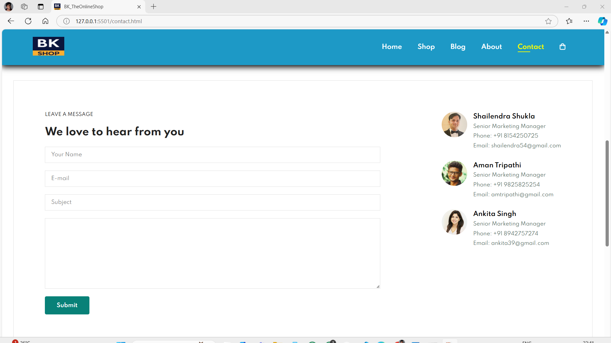

### Ecommerce Website
An Ecommerce website is an online platform that allows businesses and individuals to buy and sell products or services over the Internet. 

## Screenshots

### Home Page  1

### Home Page  2

### Home Page  3

### Home Page  4

### Shop Page  1

### Shop Page  2

### Shop Page  3

### Blog Page  1

### Blog Page  2

### About Page  1

### About Page  2

### Contact Page  1

### Contact Page  2

### Cart Page  1

### Cart Page  2

### Description 
    This is only UI (User Interface) based project.
           
#### Features
    Responsive project.

    You can see different types of products.
    
    We applied a range of CSS properties that significantly enhance the overall user experience and visual appeal.

    By applying different CSS properties based on the viewport width, we provided an optimized experience for both mobile and desktop users, enhancing accessibility and usability.

    

    
###### How to run project
Open the index.html file in a browser.

    
